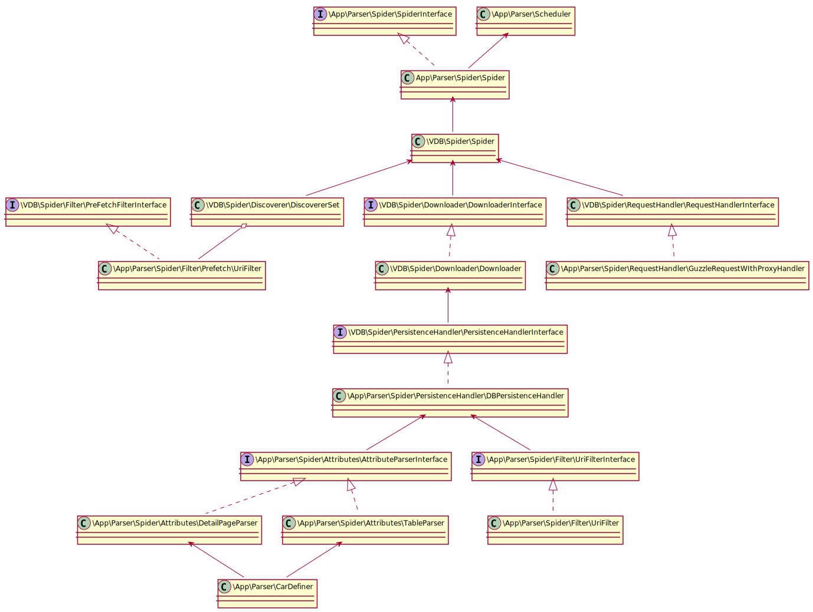

# Парсер автомобильных деталей

Данный парсер предназначен для получения информации по деталям с различных сайтов, автоматического определения марки и модели по исходным данным, и остальных динамически настраиваемых полей.

## Возможности парсера:

  - Настройка расписания работы каждого отдельного процесса парсинга
  - Отдельная настройка парсинга для каждого отдельного сайта в файле
  - Настройки конфигов в schedule.yaml и parser.yaml
  - Автоматическое логгированние процессов парсинга в текстовые файлы
  - Сохранение результатов парсера в базу и присвоение им уникальной версии
  - Настройка обработки полей парсеров (замена символов, получение строки через регулярное выражение)
  - Определение марки и модели на основании полученных данных
  - API. Для взаимодействия с клиентскими сайтами.

## Консольные команды

  - Валидация файла расписания
```sh
$ php artisan config:validate
```
  - Управление активностью парсера (--on/--off Включить/Выключить)
```sh
$ php artisan parser:status {--on} {--off}
```
  - Получение оперативной статистики по результатам работе (hour - кол-во часов за которое нужно отобразить результаты)
```sh
$ php artisan parser:statistic {hour}
Number of items received from 2017-09-19 17:22:47 to 2017-09-19 18:22:47:
Site url: http://razbor-nt.ru/ Unique elements: 783
Site url: https://sv-company.ru/ Unique elements: 33
Site url: https://разборкасокол.рф/ Unique elements: 11
```
  - Обновление списка прокси
```sh
$ php artisan proxy:update
```
  - Непосредственный запуск парсинга для конкретного сайта
Если по расписанию сайт работать не должен то он прекратит свою работу.
```sh
$ php artisan crawl:start {siteName}
```

## API запросы.

  - На парсере при подключении нового сайта необходимо добавить запись в таблицу ```application``` в которой должны храниться идентификационные данные парсера (ключ и секретный код). Для получения токена необходи сделать данный запрос вместо #authCode# необходимо ввести base64('ключ:секретный код')
#### Запрос
```sh
http://195.133.197.85/api/auth/app
Authorization: Basic #authCode#
Content-Type: application/json
```
#### Ответ
```sh
{
"token_type": "Bearer",
"access_token": "#token#"
}
```

  - Для получения информации по кол-ву новых результатов можно воспользоваться pзапросом get_package_count.
self_version - Текущая версия на сайте
elements_in_package - Желаемое кол-во элементов в пакете
#### Запрос
```sh
http://195.133.197.85/api/parser/get_package_count
Authorization: Bearer #token#
Content-Type: application/json

{"self_version":"10", "elements_in_package":100}
```
#### Ответ
```sh
{"package_count":524}
```

  - Для получения новых результатов нужно создать содинение с помощью get_connection_id.
self_version - Текущая версия на сайте
elements_in_package - Желаемое кол-во элементов в пакете
#### Запрос
```sh
http://195.133.197.85/api/parser/get_connection_id
Authorization: Bearer #token#
Content-Type: application/json

{"self_version":"10", "elements_in_package":100}
```
#### Ответ
```sh
{"connection_key":"#connection_key#"}
```

  - Для попакетного получения результатов есть запрос get_package_by_number.
connection_key - ключ соединения
package_number - номер желаемого пакета
#### Запрос
```sh
http://195.133.197.85/api/parser/get_package_by_number
Authorization: Bearer #token#
Content-Type: application/json

{"connection_key":"050f8001f7e01bbb08ef11963b98d8a7", "package_number":1}
```
#### Ответ
```sh
{"results": "#resultArray#"}
```

### Архитектура

Для работы планировцика задач необхдимо настроить следующую cron задачу:
```sh
* * * * * php artisan schedule:run 1>> /dev/null 2>&1
```
Из настроек расписания каждого парсера формируется задачи для планировщика от Laravel. Который недопускает одновременного запуска нескольких парсеров на один и тот же сайт.
Так как любой парсер изначально настроен на бесконечную работу. Останавливать его будет специальный класс ```\App\Parser\Scheduler```, который подписывается на событие работы парсера и в нужный момент безопасно останавливает его работу.

Далее непосредственно сам парсер. 
Для настройки компонентов парсера и установки значений из конфига используется ```\App\Parser\Spider\Spider```, он включает в себя ```VDB\Spider\Spider``` модули в котором мы и настраиваем.

###### Кастомные модули
 - PersistenceHandler (у нас \App\Parser\Spider\PersistenceHandler\DBPersistenceHandler)
 - RequestHandler (у нас \App\Parser\Spider\RequestHandler\GuzzleRequestWIthProxyHandler)

PersistenceHandler отвечает за сохранение данных при парсинге и предотвращает сохранение одинаковых записей. Он включает в себя парсеры атрибутов:
- \App\Parser\Spider\Attributes\DetailPageParser для детальных страниц
- \App\Parser\Spider\Attributes\TableParser для страниц с таблицей разультатов

Каждый парсер атрибутов вклчает в себя вспомогательный инструмент ```\App\Parser\CarDefiner``` предназначенный для определения марки и модели из исходных данных.

